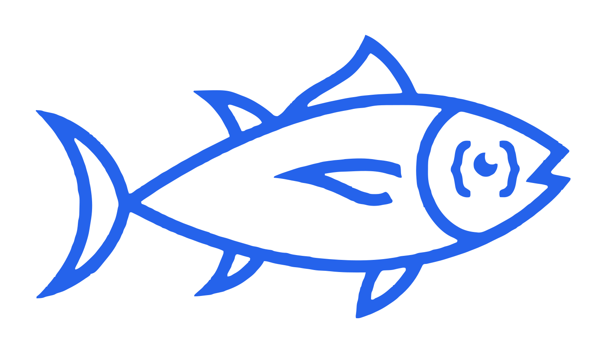

<div class="tunas-hero" markdown>

</div>

# tunas

A Python library for parsing USA Swimming meet result files (`.cl2` / SDIF v3 and Hy-Tek `.hy3`) into structured Python objects and querying offline motivational time standards.

`tunas` parses results files into clean, idiomatic objects — [`Meet`][tunas.models.Meet], [`Club`][tunas.models.Club], [`Swimmer`][tunas.models.Swimmer], [`IndividualSwim`][tunas.models.IndividualSwim], and [`Relay`][tunas.models.Relay]. Parsing is lenient by default, collecting warnings in a [`ParseReport`][tunas.ParseReport] to prevent data loss.

## Install

```bash
pip install tunas
```

Requires Python 3.12+. At present the runtime depends only on the Python standard library.

## Quick example

```python
from tunas import read_cl2, read_hy3

# read_cl2 yields one MeetArchive (meets + a parse report) per source file
for archive in read_cl2("results.cl2"):
    for meet in archive.meets:
        print(meet.name, "—", len(meet.swimmers), "swimmers")
        for swim in meet.individual_swims:
            print(swim.swimmer.full_name, swim.event.name, swim.time)

# read_hy3 parses Hy-Tek files into the exact same object graph
for archive in read_hy3("results.hy3"):
    for meet in archive.meets:
        print(meet.name, "—", len(meet.swimmers), "swimmers")
```

## Where to next

<div class="grid cards" markdown>

-   :material-rocket-launch-outline:{ .lg .middle } __Getting started__

    ---

    Install `tunas` and parse your first `.cl2` file in a few lines.

    [:octicons-arrow-right-24: Get up and running](guide/getting_started.md)

-   :material-file-document-alert-outline:{ .lg .middle } __Parsing & errors__

    ---

    Understand the parsing modes and the never-lose-data error model.

    [:octicons-arrow-right-24: Parsing files](guide/parsing.md)

-   :material-chef-hat:{ .lg .middle } __Cookbook__

    ---

    Copy-paste practical recipes for common analysis tasks.

    [:octicons-arrow-right-24: Browse recipes](guide/cookbook.md)

-   :material-graph-outline:{ .lg .middle } __Domain model__

    ---

    Learn the object graph — `Meet`, `Club`, `Swimmer`, `Relay`.

    [:octicons-arrow-right-24: Domain model](guide/models.md)

-   :material-api:{ .lg .middle } __API reference__

    ---

    Look up a specific class, function, or exception.

    [:octicons-arrow-right-24: API reference](reference/index.md)

-   :material-drawing:{ .lg .middle } __Design__

    ---

    Understand the architecture and the decisions behind it.

    [:octicons-arrow-right-24: Design notes](about/architecture.md)

</div>
